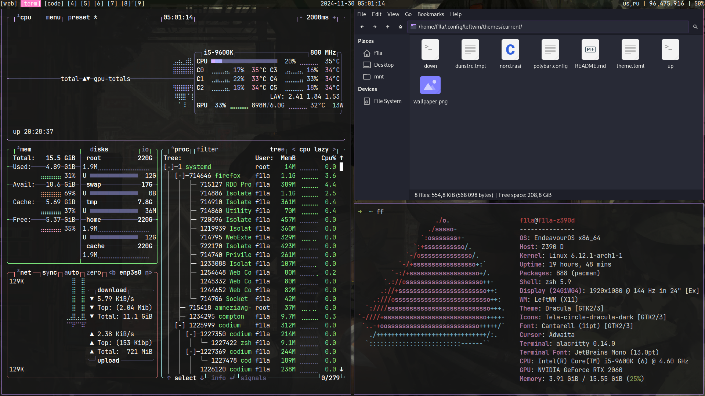

# Dotfiles Setup for LeftWM

A minimalist configuration repository for [LeftWM](https://github.com/leftwm/leftwm) and other essential desktop tools, aiming for simplicity and customization.

---

## Dependencies

### Required
Ensure the following packages are installed on your system before running the installation script:

- **LeftWM**: Tiling window manager.
- **leftwm-theme**: Theme management for LeftWM.
- **dunst**: Lightweight notification daemon.
- **picom**: Compositor for transparency and effects.
- **flameshot**: Screenshot utility.
- **nitrogen**: Wallpaper manager.
- **lemonbar**: Lightweight status bar.
- **xdotool**: Command-line X11 automation tool.
- **curl**: Command-line tool for transferring data.
- **jq**: Lightweight JSON parser.
- **setxkbmap**: Keyboard layout configuration.
- **pactl**: PulseAudio control tool.
- **lxappearance**: GTK+ theme switcher.
- **pavucontrol**: Audio volume control.

### Optional
- **polybar**: Modern and customizable status bar (alternative to Lemonbar).

To install these dependencies on a Debian-based system, you can run:
```bash
sudo apt update && sudo apt install -y leftwm leftwm-theme dunst picom flameshot nitrogen lemonbar xdotool curl jq setxkbmap pactl lxappearance pavucontrol polybar
```

---

## Installation

Clone this repository and execute the `install.sh` script to apply the configurations:
```bash
git clone <repository_url>
cd <repository_name>
chmod +x install.sh
./install.sh
```

> Note: Replace `<repository_url>` with the actual repository URL.

---

## Preview

Here’s a screenshot of the configured desktop environment:



---

## Custom Hotkeys

These are the hotkeys defined in the configuration:

- **`Mod + O`**: Set a random wallpaper using `nitrogen` or a custom script.
- **`Mod + P`**: Launch `rofi`, the application launcher.
- **`Print Screen`**: Capture a screenshot using `flameshot`.
- **`Mod + T`**: Open `thunar`, the file manager.

---

## Support

Feel free to open an issue or create a pull request for suggestions or fixes. Enjoy your newly configured desktop environment! 🎉

---